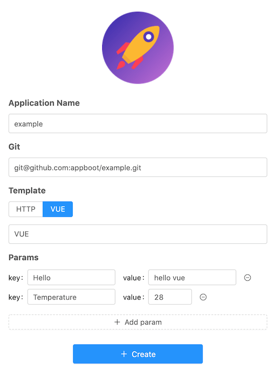

# appboot

> appboot frontend

## Usage

### Docker

1. Get the `WS_URL` from the command line output of [backend](../backend).

   ```shell
   WS_URL: ws://xxx.xxx.xxx.xxx:8888/appboot
   ```

2. Run appboot docker with `WS_URL`

   ```shell
   docker run -d --name appboot \
    -p 8080:80 \
    -e WS_URL="ws://xxx.xxx.xxx.xxx:8888/appboot" \
    appboot/frontend
   ```

3. Visit <http://localhost:8080/>

   

### Source Code

1. Project setup

   ```bash
   npm install
   ```

2. Set backend URL

   Modify `WSS_URL` in `src/config.js`, develop locally can be modified to `"ws://127.0.0.1:8888/appboot"`.
   Alternatively, you can get the `WS_URL` from the command line output of backend **as in the production** environment.

   ```shell
   WS_URL: ws://xxx.xxx.xxx.xxx:8888/appboot
   ```

3. Compiles and hot-reloads for development

   ```bash
   npm run serve
   ```

4. Compiles and minifies for production

   ```bash
   npm run build
   ```

   If you want to build a docker image, execute the following command.

   ```bash
   npm run docker
   ```

5. Lints and fixes files

   ```bash
   npm run lint
   ```

## Reference

See [Configuration Reference](https://cli.vuejs.org/config/).
